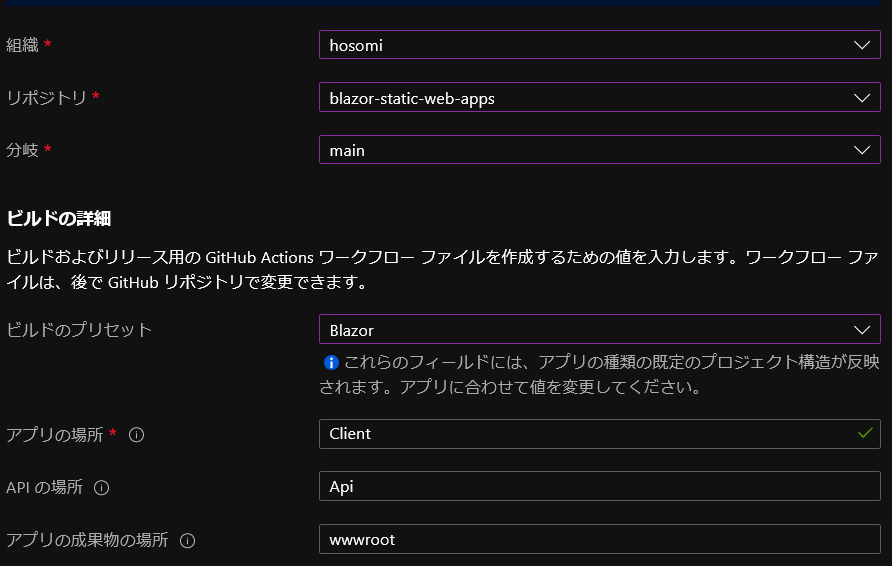

# Blazor Static Web Apps

* [Blazor WebAssembly](https://docs.microsoft.com/aspnet/core/blazor/?view=aspnetcore-3.1#blazor-webassembly) client application
* C# [Azure Functions](https://docs.microsoft.com/azure/azure-functions/functions-overview) and a C# class library with shared code.

## Structure

* **Client**: The Blazor WebAssembly application
* **API**: A C# Azure Functions API, which the Blazor application will call
* **Shared**: A C# class library with a shared data model between the Blazor and Functions application

## Deploy to Azure Static Web Apps

* [Azure Static Web Apps](https://docs.microsoft.com/azure/static-web-apps)  

* deploy setting :   
  